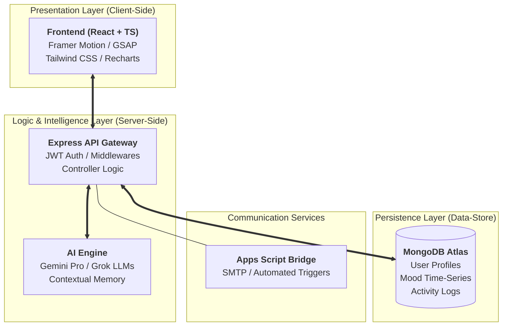

<div align="center">
 

  
  <h1>MindCare: Digital Mental Health Platform</h1>
  
  <p align="center">
    <strong>Empowering Student Wellness through Predictive AI and Peer Connectivity</strong>
  </p>

  <div align="center">
    <a href="https://mind-care-digital-mental-health.vercel.app/">
      
    </a>
  </div>

  <br />

  []()
  []()
  []()
  []()
</div>

---

## 🌟 Vision & Purpose

**MindCare** is not just a tool; it is a dedicated digital sanctuary designed to bridge the widening gap in student mental health support. In an era of increasing academic pressure, social isolation, and burnout, MindCare leverages cutting-edge technology to provide a scalable, accessible, and deeply empathetic solution for higher-education ecosystems.

### 🎯 The Mission
Our mission is to democratize mental health support by providing every student with a **Digital Twin**—a predictive model of their wellness—and an **AI Sanctuary** that listens without judgment. By integrating peer connectivity and expert clinical care, we ensure that no student has to navigate their mental health journey alone.

### 💡 Core Philosophy: Empathy by Design
We believe that technology should feel human. Every interaction within MindCare—from the soft, hardware-accelerated animations to the stateful conversational logic—is engineered to reduce cognitive load and provide immediate emotional relief.

---

## 📸 Platform Interface


---

## 🏛️ System Architecture

MindCare is built on a high-performance **MERN Stack** with a modular, tiered architecture designed for scalability and clinical reliability.

### 🔳 3D Layered Architecture Diagram



---

## 🚀 Key Modules & Innovations

### 🛠️ The AI Sanctuary
A stateful, context-aware conversational terminal that serves as a student's first point of contact.
- **Agentic Logic:** Uses session-based history to maintain a continuous support loop.
- **Clinical Empathy:** Trained on CBT (Cognitive Behavioral Therapy) frameworks to provide validated coping strategies.

### 🧬 Digital Twin Analytics
A proactive wellness engine that creates a behavioral profile of the student.
- **Stress Prediction:** Analyzes mood inputs and identifies stressors before burnout occurs.
- **Personalized Recommendations:** Suggests specific resources based on identified stressors (e.g., Exam Pressure vs. Loneliness).

### 👥 Peer Buddy & Peer Groups
A moderated environment facilitating community resilience.
- **Peer Buddy:** Direct, anonymous peer-to-peer support.
- **Peer Groups:** Interest-based mental health support circles.

### 🏥 Expert Consultations
A bridge between digital self-care and professional clinical intervention.
- **Seamless Booking:** Real-time scheduling with university counsellors.
- **Automated Alerts:** Clinical confirmations sent via secure email/SMS channels.

---

## 🛠️ Technical Implementation Details

### **Tech Stack Deep Dive**
- **Frontend Core:** React 18, TypeScript (Type-safe components).
- **Animation Framework:** GSAP & Framer Motion for premium, hardware-accelerated transitions.
- **State Management:** React Context API for localized state and auth persistence.
- **Backend Architecture:** RESTful Node.js API with Mongoose ODM.
- **Infrastructure:** Vercel (Frontend), Render (Backend), MongoDB Atlas (DB).

---

## 🛠️ Setup & Installation

### **1. Environment Variables**
Configure the following in your `.env` files:

**Backend (`/backend/.env`):**
```env
PORT=3000
MONGODB_URI=...
JWT_SECRET=...
GEMINI_API_KEY=...
APPS_SCRIPT_WEBHOOK_URL=...
```

**Frontend (`/frontend/.env`):**
```env
VITE_API_URL=https://your-backend-url.com
```

### **2. Launching the Platform**
```bash
# Install root dependencies
npm install

# Start Backend
cd backend
npm install
npm start

# Start Frontend
cd ../frontend
npm install
npm run dev
```

---

<div align="center">
  <p><strong>Developed for the University Mental Health Initiative</strong></p>
  <p><em>Advancing mental health support through digital innovation.</em></p>
</div>
